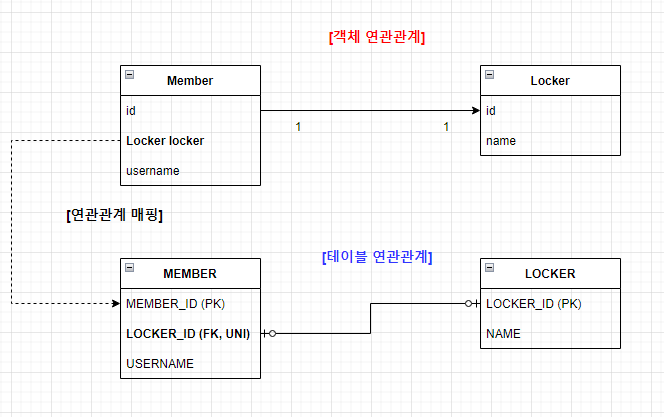
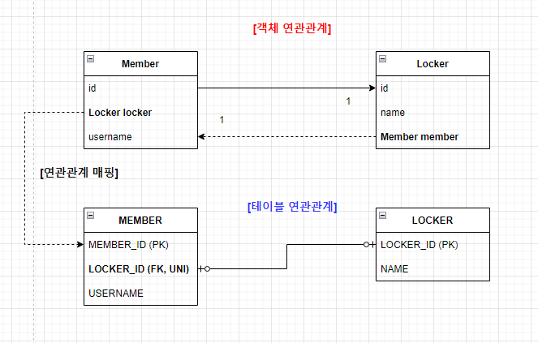
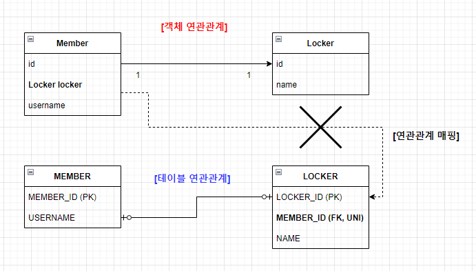
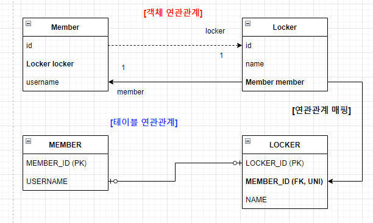

## 6장. 다양한 연관관계 매핑

* 연관관계 매핑시 고려할 점 3가지
    - 다중성
        + 다대일(@ManyToOne), 일대다(@OneToMany), 일대일(@OneToOne), 다대다(@ManyToMany)
    - 단방향, 양방향
        + 테이블은 외래 키를 사용하여 양방향 쿼리가 가능하므로 방향이라는 개념 X
        + 객체는 참조용 필드를 가진 객체만 연관된 객체를 조회 가능(한쪽만 참조 : 단방향, 양쪽이 서로 참조 : 양방향)
    - 연관관계의 주인(양방향일 때)
        + 외래 키 관리권한을 가진 객체

* 다대일 연관관계(단방향)
    - 다대일(N:1) 연관관계는 여러 개의 엔티티(자식)가 하나의 엔티티(부모)를 참조하는 구조
    - 회원은 Member.team으로 팀 엔티티를 참조할 수 있지만 팀 엔티티는 Team.member가 불가능하다
    > 따라서 회원과 팀은 다대일 연관관계
    
    ```java
    @ManyToOne
    @JoinColumn(name = "TEAM_ID")   // Member.team 필드를 TEAM_ID 외래 키와 매핑
    private Team team;
    ```
    > 항상 @ManyToOne이 연관관계의 주인 = 외래 키는 항상 다(N)쪽에 존재

* 다대일 연관관계(양방향)
    - 외래 키가 있는 객체가 연관관계의 주인 = 외래 키는 항상 다(N)쪽에 존재
    - 양방향 연관관계는 항상 서로 참조해야 한다
        + 연관편의 메소드를 작성하는게 좋음
    - 양방향 연관관계에서 순환참조 문제
        + 엔티티를 직접 반환하지 않고 DTO로 변환하여 필요한 정보만 반환
    ```java
    @Entity
    public class Member {
        @Id @GeneratedValue
        private Long id;
        private String name;

        @OneToMany(mappedBy = "member")
        private List<Order> orders = new ArrayList<>();
    }

    @Entity
    public class Order {
        @Id @GeneratedValue
        private Long id;
        private String productName;

        @ManyToOne
        @JoinColumn(name = "member_id")
        private Member member;
    }
    ```
    1. Member > orders(List<Order>)
    2. Order > member(Member)
    3. 다시 1번 반복...
    > 무한루프에 빠짐

* 일대다 연관관계(단방향)
    ```java
    Member (1) → Order (N)  
    Order는 Member를 모름
    ```
    - 외래키는 항상 다(N)쪽에서 관리해야하는데, 반대로 One쪽에서 관리하는 구조
    - 일대다 단방향 연관관계는 @JoinColumn을 반드시 사용해야 한다
        + 사용하지 않는 경우 JoinTable 방식을 사용, Team_member라는 중간 테이블이 생성된다
    ```java
    Member member = new Member();
    member.setName("홍길동");

    Order order1 = new Order();
    Order order2 = new Order();

    member.getOrders().add(order1);
    member.getOrders().add(order2);

    entityManager.persist(member);
    ```

    ```sql
    -- 1. member 저장
    INSERT INTO member (name) VALUES ('홍길동');

    -- 2. order1 저장 (외래 키 없음)
    INSERT INTO orders (product_name) VALUES ('상품1');

    -- 3. order2 저장 (외래 키 없음)
    INSERT INTO orders (product_name) VALUES ('상품2');

    -- 4. 외래 키 업데이트
    UPDATE orders SET member_id = ? WHERE id = ?;
    UPDATE orders SET member_id = ? WHERE id = ?;
    ```
    > insert 후 update가 추가로 발생 > 성능 저하<br/>트랜잭션 단위에서 복잡한 흐름이 발생

    | 문제점                | 설명                                                      |
    | ------------------ | ------------------------------------------------------- |
    | ❌ 추가적인 flush       | `@JoinColumn`으로 인해 외래 키를 나중에 설정해야 하므로 flush 타이밍 복잡      |
    | ❌ DB 제약조건 위반 위험    | `order.member_id`가 `NOT NULL`인데 insert 시 `NULL`이면 에러 발생 |
    | ❌ rollback 처리 시 복잡 | 중간에 예외 발생 시 INSERT + UPDATE + rollback 관리가 꼬일 수 있음      |
    | ❌ cascade 연계 시 혼란  | cascade 동작 시점이 꼬이면 외래 키 설정 실패하거나 예외 발생 가능               |
    | ❌ Batch Insert 비효율 | batch insert를 사용해도 중간에 update가 끼어 들어 비효율                |
    | ❌ 외래키 제약조건 설정 어려움 | @joinColumn은 테이블 구조만 바꿀뿐 실제로 Order.member_id가 Order 엔티티에 없으므로 외래 키에 DB 무결성 제약을 걸기 어렵다<br/>객체 관점과 DB 관점에 불일치|
    | ❌ 연관관계의 주인이 아닌데 외래 키를 관리| 일반적으로 외래 키를 가진 다(N)쪽이 연관관계의 주인, JPA 설계 원칙에 어긋남|

* 일대다 연관관계(양방향)
    - 일대다 단방향 연관관계와 같은 단점을 공유
    ```java
    @ManyToOne
    @JoinColumn(name = "TEAM_ID")
    private Team team;

    @ManyToOne
    @JoinColumn(name = "TEAM_ID", insertable = false, updatable = false)
    private Team team;
    // 둘 다 같은 키를 관리하는 형태가 되므로 문제가 발생한다
    // insertable, updatable 옵션으로 읽기만 가능하도록 설정하여 해결
    ```

* 일대일 연관관계
    - 일대일의 반대는 일대일
    - 외래 키에 유니크 제약조건 추가

    | 방식              | 설명                               | 특징                      |
    | --------------- | -------------------------------- | ----------------------- |
    | 주 테이블이 외래 키 가짐  | 일반적인 방식 (주 테이블에서 @JoinColumn 사용) | 성능 좋음, 단방향/양방향 모두 사용 가능 |
    | 대상 테이블이 외래 키 가짐 | mappedBy 방식 사용                   | 연관관계의 주인이 반대편           |

    - @OneToOne을 사용하여 일대일 연관관계임을 나타냄
    - 주 테이블에 외래키 단방향 설정
        + MEMBER가 주 테이블이고 LOCKER는 대상 테이블
        + 일대일 관계이므로 객체 매핑에 @OneToOne을 사용함, DB에는 LOCKER_ID 외래 키에 유니크 제약 조건 추가
    ```java
    @Entity
    public class Member {
        ...
        @OneToOne
        @JoinColumn(name = "LOCKED_ID")
        private Locker locker;
        ...
    }

    @Entity
    public class Locker {
        ...
        @Id @GeneratedValue
        @Column(name = "LOCKED_ID")
        private Long id;
        ...
    }
    ```
    

    - 주 테이블에 외래키 양방향 설정
        + 양방향이므로 연관관계의 주인을 설정해야 한다
        + MEMBER 테이블이 외래 키를 가지고 있으므로 Member 엔티티의 Member.locker가 연관관계의 주인이다
     ```java
    @Entity
    public class Member {
        ...
        @Id @GeneratedValue
        @Column(name = "MEMBER_ID")
        private Long id;

        @OneToOne
        @JoinColumn(name = "LOCKED_ID")
        private Locker locker;
        ...
    }

    @Entity
    public class Locker {
        ...
        @Id @GeneratedValue
        @Column(name = "LOCKED_ID")
        private Long id;

        @OneToOne(mappedBy = "locker")
        private Member member;
        ...
    }
    ```
    

    - 대상 테이블에 외래키 단방향 설정
        + 일대일 단방향 연관관계에서 대상 테이블이 외래 키를 가지면 객체는 단방향으로만 참조하지만 DB에서는 외래 키가 반대편(대상 테이블)에 위치하게 된다
        + JPA에서 연관관계의 주인은 외래 키를 가진 쪽인데, 단방향 관계에서 주인이 아닌 쪽에서 참조하는 구조를 만들면 JPA가 외래 키 관리를 못한다
        > JPA에서 기본적으로 지원하지 않는 구조
    ```java
    Member → MemberCard  
    // 하지만 DB에서는 member_card.member_id (FK)
    ```
    

    - 대상 테이블에서 외래키 양방향 설정
        + 일대일 매핑에서 대상 테이블에 외래 키를 두고 싶으면 양방향으로 매핑해야 한다
    ```java
    @Entity
    public class Member {
        ...
        @Id @GeneratedValue
        @Column(name = "MEMBER_ID")
        private Long id;

        @OneToOne(mappedBy = "member")
        private Locker locker;
        ...
    }

    @Entity
    public class Locker {
        ...
        @Id @GeneratedValue
        @Column(name = "LOCKED_ID")
        private Long id;

        @OneToOne
        @JoinColumn(name = "MEMBER_ID")
        private Member member;
        ...
    }
    ```
    

* 다대다 연관관계
    - 양쪽 엔티티가 서로 여러개를 참조하는 관계
    - 관계형 DB에서는 다대다 관계를 직접 표현할 수 없으므로 중간 테이블(연결 테이블)을 사용한다
    ```sql
    students
    +----+--------+
    | id | name   |
    +----+--------+

    courses
    +----+--------+
    | id | title  |
    +----+--------+

    student_course (중간 테이블)
    +-------------+--------------+
    | student_id  | course_id    |
    +-------------+--------------+
    ```
    
    - 객체는 테이블과 다르게 객체 2개로 컬렉션을 사용하면 다대다 관계를 만들 수 있다
        + @JoinTable : 연결 테이블을 명시
        + joinColumns : 현재 엔티티의 FK
        + inverseJoinColumns : 상대 엔티티의 FK
    ```java
    @Entity
    public class Student {

        @Id @GeneratedValue
        private Long id;

        private String name;

        @ManyToMany
        @JoinTable(
            name = "student_course",
            joinColumns = @JoinColumn(name = "student_id"),
            inverseJoinColumns = @JoinColumn(name = "course_id")
        )
        private List<Course> courses = new ArrayList<>();
    }

    @Entity
    public class Course {

        @Id @GeneratedValue
        private Long id;

        private String title;

        @ManyToMany(mappedBy = "courses")
        private List<Student> students = new ArrayList<>();
    }
    ```

    - @ManyToMany의 문제점
        + 중간 테이블에 추가 컬럼을 넣을 수 없음 - 수강신청 날짜, 수강 상태, 점수 등
        + 엔티티로 직접 접근이 어려움
    > 중간 테이블을 엔티티로 분리한다
    ```java
    @Entity
    public class StudentCourse {

        @Id @GeneratedValue
        private Long id;

        @ManyToOne
        @JoinColumn(name = "student_id")
        private Student student;

        @ManyToOne
        @JoinColumn(name = "course_id")
        private Course course;

        private LocalDateTime enrolledDate;
        private String grade;
    }

    @Entity
    public class Student {
        @Id @GeneratedValue
        private Long id;

        @OneToMany(mappedBy = "student")
        private List<StudentCourse> studentCourses = new ArrayList<>();
    }

    @Entity
    public class Course {
        @Id @GeneratedValue
        private Long id;

        @OneToMany(mappedBy = "course")
        private List<StudentCourse> studentCourses = new ArrayList<>();
    }
    ```

    | 항목    | 설명                         |
    | ----- | -------------------------- |
    | 기본 매핑 | `@ManyToMany + @JoinTable` |
    | 문제점   | 중간 테이블에 추가 컬럼 못 넣음         |
    | 실무 방식 | 중간 테이블을 별도 엔티티로 분리         |
    | 권장 구조 | 1\:N + N:1 (다대다 분해)        |

* 복합 기본키(Composite Primary Key)
    - 2개 이상의 컬럼이 모여서 기본 키의 역할을 하는 것
    - 단일 id가 아닌 여러 컬럼이 모여 기본 키를 구성하는 구조
    ```sql
    CREATE TABLE enrollment (
        student_id BIGINT,
        course_id BIGINT,
        PRIMARY KEY (student_id, course_id)
    );
    ```
    - JPA에서는 2가지 방법으로 복합 키를 매핑한다
      
    | 방식            | 특징                           |
    | ------------- | ---------------------------- |
    | `@IdClass`    | 외부에 별도의 PK 클래스 정의, 비교적 간단    |
    | `@EmbeddedId` | 내장 타입(복합 키 객체)을 통한 표현, 객체지향적 |

    - @IdClass 방식
    ```java
    public class EnrollmentId implements Serializable {
        private Long studentId;
        private Long courseId;

        // equals() and hashCode() 반드시 구현
    }

    @Entity
    @IdClass(EnrollmentId.class)
    public class Enrollment {

        @Id
        private Long studentId;

        @Id
        private Long courseId;

        private LocalDateTime enrolledAt;
    }
    ```

    - @EmbeddedId 방식
    ```java
    @Embeddable
    public class EnrollmentId implements Serializable {
        private Long studentId;
        private Long courseId;

        // equals() and hashCode() 필수
    }

    @Entity
    public class Enrollment {

        @EmbeddedId
        private EnrollmentId id;

        private LocalDateTime enrolledAt;
    }
    ```

    | 항목    | `@IdClass`    | `@EmbeddedId`                 |
    | ----- | ------------- | ----------------------------- |
    | 사용 방식 | PK 필드를 개별로 선언 | 하나의 ID 객체로 묶음                 |
    | 객체지향적 | ❌ 덜함          | ✅ 더 좋음                        |
    | 편의성   | ✅ 단순          | 다소 복잡 (복합 ID 클래스를 생성자에 넣어야 함) |
    | 실무 활용 | 간단한 경우 적합     | 연관관계 포함한 경우 적합                |
